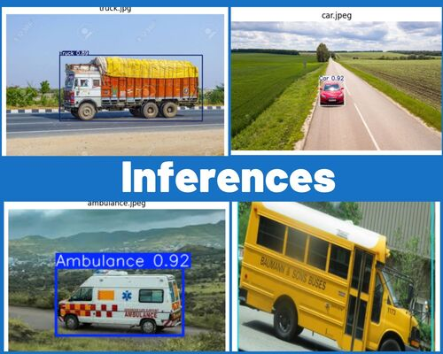

# Adaptive Traffic Signal Control System

This project is divided into 2 part ; the first part involves vehicle detection using a fine-tuned Yolo Model and the other a SUMO simulation to visualize real-time traffic scenario and how an adaptive algorithm can solve traffic congestion issues.

---


## 📸 Yolov11 detection module : 

### Image Inferences : 




### Video Inferences : 


---


## 🧠 Model Info

- **Models Used**: YoloV11 (trained on Coco dataset)
- **Classes**: 5 vehicle classes: Car, Truck, Bike, Ambulance, Bus
- **Framework**: Pytorch and OpenCV
- **Dataset**:  [Click here]() 
  🔗 [Download it here](https://public.roboflow.com/object-detection/vehicles-openimages)

---


## 📁 Project Structure

```
Vehicle-detection/
├── app.py
├── templates/
│   └── index.html
├── ouptut/
│   └── output.avi
├── model-dev/
│   └── Vehicle_detection.ipynb
├── static/
│   └── demo/
│       ├── collage.jpg
│       └── output.gif
├── best.pt
├── requirements.txt
└── README.md
```


## ⚙️ How to Run Locally

1. **Clone the repository**  
   ```bash
   git clone https://github.com/pic-road/crop-disease-detection.git
   cd vehicle_detection
   pip install -r requirements.txt
   ```

2. **Train MobileNet model**  
   - Open `developing-models/MobileNet.ipynb` on **Google Colab** (recommended for GPU support)
   - Train and export the model as `MobileNet.h5`

3. **(Optional) Train VGG16 model**  
   - Write and run a similar notebook `VGG16.ipynb` to fine-tune and save the VGG16 model

4. **Run the Flask app locally**  
   ```bash
   python app.py
   ```
