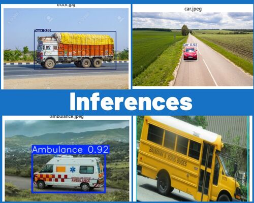

# 🚦 Adaptive Traffic Signal Control System 🚦

## Project Overview

This project is divided into two parts:

1. **Vehicle Detection**  
   This part involves vehicle detection using a fine-tuned YOLOv11 model.

2. **SUMO Simulation**  
   This part includes a SUMO simulation to visualize real-time traffic scenarios and demonstrate how an adaptive algorithm can help solve traffic congestion issues.
   
   
   

---


## 🚙🔍 Yolov11 detection module : 

### Image Inferences : 




### Video Inferences : 


---


##  Model Info

- **Models Used**: YoloV11 (trained on Coco dataset)
- **Classes**: 5 vehicle classes: Car, Truck, Bike, Ambulance, Bus
- **Framework**: Pytorch and OpenCV
- **Dataset**:  Vehicles-openimages
  🔗 [Download it here](https://public.roboflow.com/object-detection/vehicles-openimages)

---


## 📁 Project directory

```
Vehicle-detection/
├── app.py
├── templates/
│   └── index.html
├── ouptut/
│   └── output.avi
├── model-dev/
│   └── Vehicle_detection.ipynb
├── static/
│   └── demo/
│       ├── collage.jpg
│       └── output.gif
├── best.pt
├── requirements.txt
└── README.md
```


## ➤ 모 How to Run Locally 모

1. **Clone the repository**  
   ```bash
   git clone https://github.com/pic-road/vehicle_detection.git
   cd vehicle_detection
   pip install -r requirements.txt
   ```

2. **Train YoloV11**  
   - Open `model-dev\Vehicle_detection.ipynbb` or use it as reference
   - Train and save model weights `best.pt` -> Usually daved to runs/detect/train directory after model training

3. **Run the Flask app locally**  
   ```bash
   python app.py
   ```
